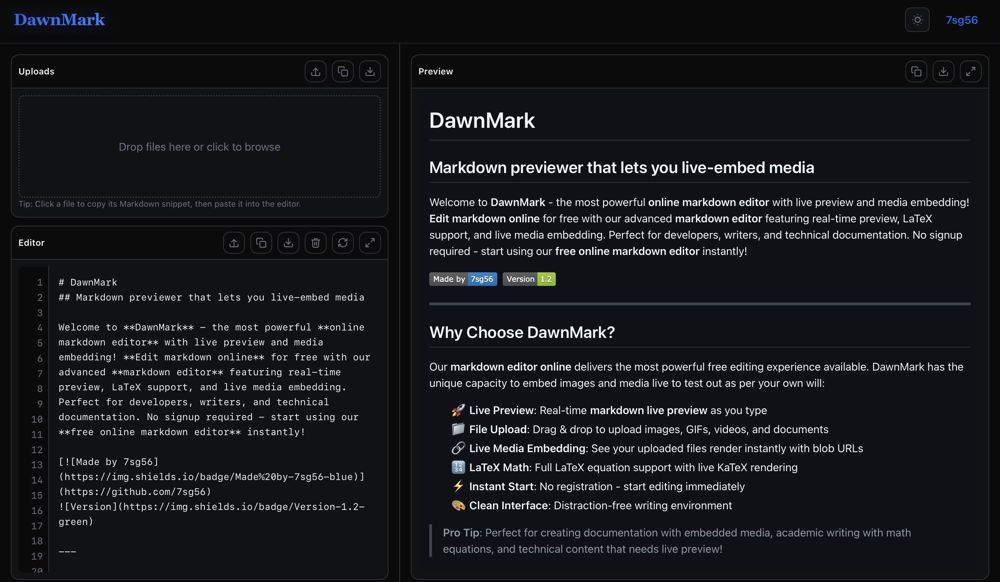

# DawnMark

A modern, professional Markdown editor built with Next.js 15 that provides real-time preview, file management, and mathematical expression support. DawnMark combines the simplicity of Markdown with powerful features for technical writing and documentation.



> Experience DawnMark in action at [dawnmark.netlify.app](https://dawnmark.netlify.app)

## Features

### Core Functionality
- **Live Preview**: Instant Markdown rendering with synchronized scrolling
- **Syntax Highlighting**: Code blocks with highlight.js and 180+ language support
- **File Management**: Drag & drop file uploads with automatic blob URL generation
- **LaTeX Support**: Mathematical expressions via KaTeX (`$inline$` and `$$display$$`)
- **Export Options**: Save as Markdown (.md) or HTML files

### User Experience  
- **Theme Switching**: Dynamic dark/light mode with proper syntax highlighting themes
- **Auto-save**: Content automatically saved to localStorage
- **Responsive Design**: Optimized for desktop editing workflows
- **Accessibility**: ARIA labels, keyboard navigation, and screen reader support

## Quick Start

```bash
# Clone and install
git clone https://github.com/7sg56/dawnmark-v3.git
cd dawnmark-v3
npm install

# Development
npm run dev

# Production
npm run build
npm run start
```

Open [http://localhost:3000](http://localhost:3000) to view the application.

## Usage

### Basic Editing
- **Editor Panel**: Type Markdown syntax in the left panel
- **Preview Panel**: See real-time rendered output on the right
- **Auto-save**: Your work is automatically saved to browser storage

### File Attachments
- Drag and drop files into the upload area or click to browse
- Images generate `` snippets
- Other files create `[filename](blob:url)` download links
- Click generated snippets to copy to clipboard

### Mathematical Expressions
- **Inline math**: `$E = mc^2$` renders as $E = mc^2$
- **Display math**: `$$\sum_{i=1}^{n} x_i$$` renders as centered equations
- Full KaTeX syntax support for complex mathematical notation

### Customization
- **Theme Toggle**: Switch between dark and light modes (header button)
- **Export**: Download your work as `.md` or `.html` files
- **Syntax Themes**: Code highlighting automatically matches your selected theme

## Tech Stack

### Frontend Framework
- **Next.js 15** - React framework with App Router and Turbopack
- **React 19** - Latest React features with concurrent rendering
- **TypeScript** - Full type safety and IntelliSense support

### Styling & UI
- **Tailwind CSS v4** - Utility-first CSS framework via PostCSS
- **Custom CSS Variables** - Dynamic theming system
- **Responsive Design** - Mobile-first approach with breakpoints

### Markdown & Content Processing
- **Marked** - Fast Markdown parser with GFM support
- **KaTeX** - High-quality mathematical typesetting
- **highlight.js** - Syntax highlighting for 180+ languages
- **DOMPurify** - XSS protection and HTML sanitization

## Architecture

- **Client-Side Only**: No backend dependencies, runs entirely in browser
- **Component-Based**: Modular React components (Editor, Preview, Upload, Theme)
- **Local Storage**: Automatic content persistence without external databases
- **Blob URLs**: Secure file handling without server uploads
- **CSS Custom Properties**: Dynamic theme switching without JavaScript re-renders

## Deployment

Deploy to [Vercel](https://vercel.com) (recommended), [Netlify](https://netlify.com), or any Next.js-compatible platform.

**Live Example**: This project is deployed at [dawnmark.netlify.app](https://dawnmark.netlify.app) using Netlify's automatic deployment from GitHub.

## License

This project is licensed under the MIT License - see the [LICENSE](LICENSE) file for details.

---

Made by [Sourish Ghosh](https://github.com/7sg56)
